# Wireless Network-Ready Intelligent Traffic Management Reference Implementation
## Overview


Wireless Network-Ready Intelligent Traffic Management is designed to
detect and track vehicles and pedestrians and provides the
intelligence required to estimate a safety metric for an
intersection. In addition, the Intel® Smart Edge Open toolkit
included in the reference implementation could be used to host a 5G
radio access network (RAN) on the same edge device when implemented on a
platform supporting a 5G RAN.

Vehicles, motorcyclists, bicyclists and pedestrians are detected and
located in video frames via object detection deep learning
modules. Object tracking recognizes the same object detected across
successive frames, giving the ability to estimate
trajectories and speeds of the objects. The reference
implementation automatically detects collisions and near-miss
collisions. A real-time dashboard visualizes the intelligence extracted
from the traffic intersection along with annotated video stream(s).

This collected intelligence can be used to adjust traffic light cycling
to optimize the traffic flow of the intersection in near real time, or
to evaluate and enhance the safety of the
intersection. For example, emergency services notifications, i.e, 911
calls, could be triggered by collision detection, reducing emergency
response times. Intersections with higher numbers of collisions and
near-miss collision detections could be
flagged for authority's attention as high-risk intersections.

The data from the traffic cameras in the intersection can be
routed easily using the [SmartEdge-Open high-speed data
plane](https://github.com/open-ness/specs/blob/master/doc/architecture.md#dataplanecontainer-network-interfaces)
for near-real time video analytics in the field.
Further, SmartEdge-Open helps to build and manage the infrastructure to
deploy, monitor, and orchestrate virtualized applications across
multiple edge devices.

To run the reference implementation, you will need to first download and install the [Intel® Smart Edge Open Developer Experience Kit](https://software.intel.com/iot/edgesoftwarehub/download/home/Smart_Edge_Open_Developer_Experience_Kits).

Once you have installed the Intel® Smart Edge Open Developer Experience Kit, select **Configure & Download** to download the reference implementation and the software listed below.

[Configure & Download](http://software.intel.com/iot/edgesoftwarehub/download/home/ri/wireless_network_ready_intelligent_traffic_management)


| Table 1 |  |
| --------------------------- | ---------------------------------- |
|  **Time to Complete**       | 10- 15 minutes |
|  **Programming Language**   | Python\* |
|  **Software**               | Intel® Distribution of OpenVINO™ toolkit 2021 Release |
|                             | Intel® Smart Edge Open 21.12 |


## Target System Requirements

### Edge Nodes

-   One of the following processors:

    -   Intel® Xeon® Scalable processor.

    -   Intel® Xeon® processor D.

-   At least 64 GB RAM.

-   At least 256 GB hard drive.

-   An Internet connection.

-   Ubuntu\* 20.04 LTS Server
    
-   IP camera or pre-recorded video(s)

## How It Works

The application uses the inference engine and the Intel® Deep Learning Streamer (Intel® DL Streamer). The solution is
designed to detect and track vehicles and pedestrians by using
Intel® Smart Edge Open (version 21.09).

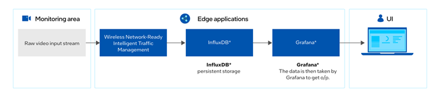

Figure 1: How It Works

The Wireless Network-Ready application requires the application pod,
database and a visualizer. Once the installation is successful, the
application is ready to be deployed using helm. After the deployment,
the application pod takes in the virtual/real RTSP stream addresses and
performs inference and sends metadata for each stream to the influxdb
database. The visualizer in parallel shows the analysis over the
metadata like pedestrians detected, observed collisions and processed
video feed.

The application has capability to perform inferences over as much as 20
channels. In addition, the visualizer is capable to show each feed
separately as well as all the feeds at the same time using Grafana\*. The
user can visualize the output remotely over a browser, provided that
they are in same network.

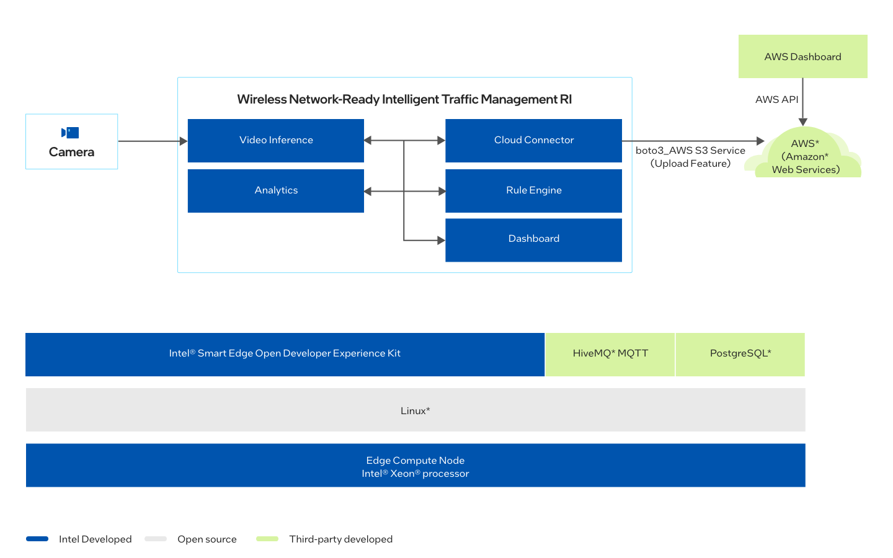


Figure 2: Architecture Diagram

## Get Started

### Prerequisites

To run the reference implementation, you will need to first download and install the [Intel® Smart Edge Open Developer Experience Kit](https://software.intel.com/iot/edgesoftwarehub/download/home/Smart_Edge_Open_Developer_Experience_Kits).

Ensure that the following conditions are met properly to ensure a smooth installation process for a reference implementation done through Edge Software Provisioner (ESP) Intel® Smart Edge Open Developer Experience Kit package.

1.  Hardware Requirements

    Make sure you have a fresh **Ubuntu\* 20.04 LTS Server** installation
    with the Hardware specified in the

    “**Target System Requirements**” section.


### Step 1: Install the Reference Implementation

>**NOTE:** The following sections may use &lt;Controller_IP&gt; in a URL
or command. Make note of your Edge Controller’s IP address and
substitute it in these instructions. For a single-node installation, the
Controller_IP is the same as your device IP address.

Select **Configure &
Download** to download
the reference implementation and then follow the steps below to install
it.

[Configure &
Download](https://software.intel.com/iot/edgesoftwarehub/download/home/ri/wireless_network_ready_intelligent_traffic_management)

1.  Make sure that the Target System Requirements are met properly
    before proceeding further.

-   For single-device mode, only one machine is needed. (Both controller
    and edge node will be on same device.)

    ><span style="color:red">**Warning:** Multi Device is not supported currently for this release.</span>

2.  If you are behind a proxy network, please ensure that proxy addresses are configured in the system.

    ```
    export http_proxy=proxy-address:proxy-port
    
    export https_proxy=proxy-address:proxy-port
    ```


3.  Create the User for Intel® Smart Edge Open.
    ```
    adduser "smartedge-open"

    passwd "smartedge-open"

    echo "smartedge-open ALL=(ALL) NOPASSWD:ALL" |sudo tee /etc/sudoers.d/smartedge-open
    ```

4.  Open a new terminal as a smartedge-open user and move the downloaded .zip package to the /home/smartedge-open folder.
    ```
    su - smartedge-open
    
    mv path-of-downloaded-directory/wireless_network_ready_intelligent_traffic_management.zip /home/smartedge-open
    ```

5.  Go to the /home/smartedge-open directory using the following command
    and unzip the RI.
    ```
    cd /home/smartedge-open
    
    unzip wireless_network_ready_intelligent_traffic_management.zip
    ```

6.  Go to the wireless_network_ready_intelligent_traffic_management/
    directory.

    `cd wireless_network_ready_intelligent_traffic_management`

7.  Change permissions of the executable edgesoftware file to enable
    execution.

    `chmod 755 edgesoftware`

8.  Run the command below to install the Reference Implementation:

    `./edgesoftware install`

9.  During the installation, you will be prompted for the Product Key.
    The Product Key is contained in the email you received from Intel
    confirming your download.

    > **NOTE:** Installation logs are available at path:
    >
    > /var/log/esb-cli/Wireless_NetworkReady_Intelligent_Traffic_Management_&lt;version&gt;/&lt;Component_Name&gt;/install.log
    
    

Figure 3: Product key


10.  When the installation is complete, you see the message “Installation
    of package complete” and the installation status for each module.

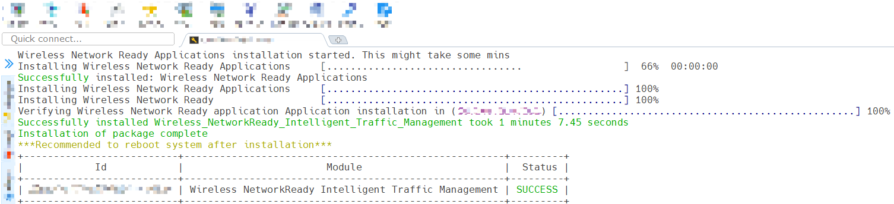

Figure 4: Successful installation

11.  If Intel® Smart Edge Open was installed successfully, running the following
    command should show output similar to the image below. All the pods
    should have a status of either Running or Completed.

&emsp;`kubectl get pods -A`

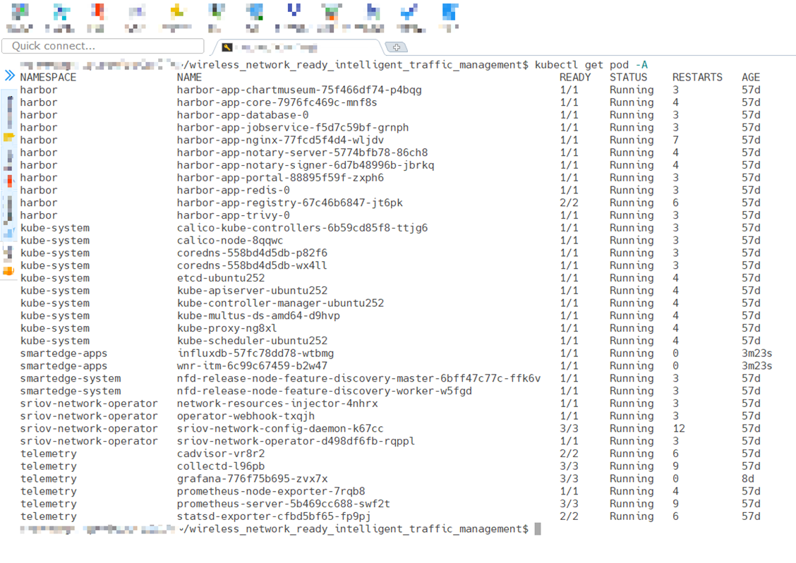

Figure 5: Status of pods

### Step 2: Check the Application

Check the Wireless_NetworkReady_Intelligent_Traffic_Management pod with the command:

&emsp;`kubectl get pod -n smartedge-apps`

You will see output similar to:

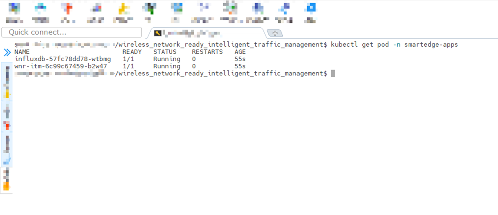

Figure 6: Status of Wireless Network-Ready ITM pods

>**NOTE:** If the pods have a status of “ContainerCreating”, please wait
for some time, since Kubernetes will pull the images from the registry
and then deploys them. This happens only the first time the containers
are deployed, and the wait time will depend upon the network bandwidth
available.

### Step 3: Data Visualization on Grafana

1.  Navigate to https://Controller_IP:30300/dashboard on your browser
    to check Wireless Network-Ready ITM dashboard.

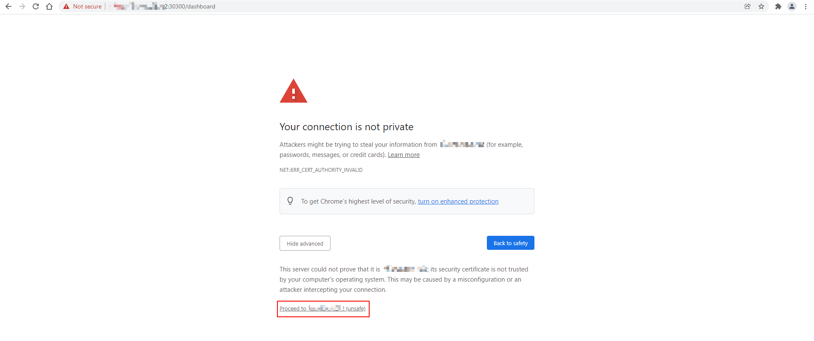

Figure 7: Login Wireless Network-Ready ITM dashboard

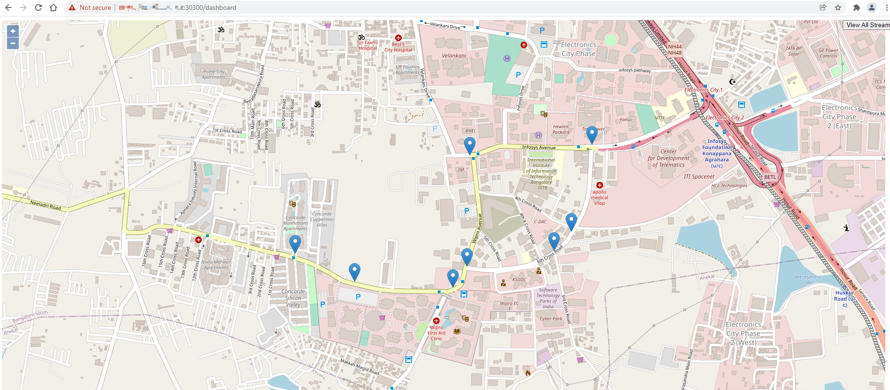

Figure 8: Wireless Network-Ready ITM dashboard

2.  Navigate to **&lt;Controller_IP&gt;:32000** on your
    browser to login Grafana dashboard.

3.  Get **Grafana Password** with the command:

&emsp;`kubectl get secrets/grafana -n telemetry -o json | jq -r '.data."admin-password"' | base64 -d`

4.  Login with user as **admin** and password as **Grafana Password**

5.  Click **Home** and Select the **ITM** to open the main dashboard.

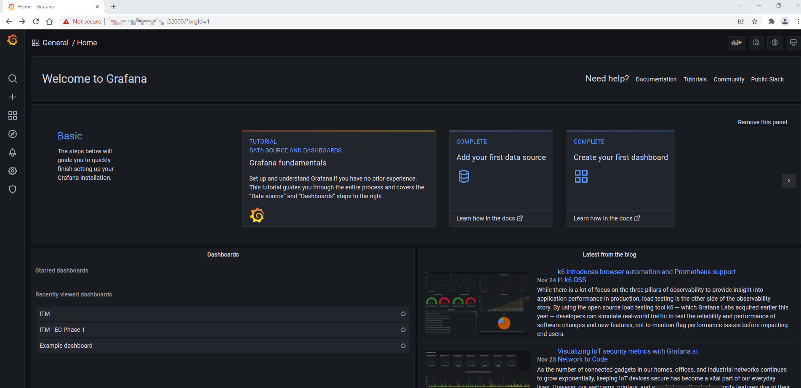

Figure 9: Grafana Home Screen


Figure 10: Grafana Dashboard list

An example of the Wireless Network-Ready ITM dashboard:

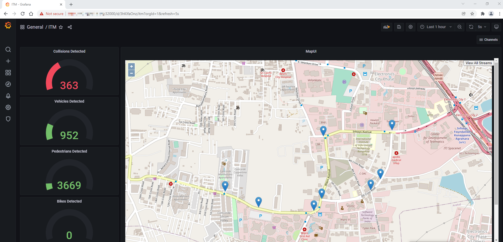

Figure 11: Grafana Main Dashboard – Wireless Network-Ready ITM

The above dashboard shows the number of vehicles, pedestrians and
collisions detected on the left side. These may be used for adjusting
traffic lights and calling emergency services if collisions are
detected.

The blue drop pins on the Map are the geographic coordinates of camera.
By clicking on these pins, a small window of the camera feed can be
visible with the detection results, as shown in the figure below.


Figure 12: Detection results on MapUI

To open the Grafana Dashboard for a particular camera with the detection
results and other data metrics, click on the camera feed on the small
window, as shown in the figure below.

>**NOTE:** To close the small window with camera feed, click the close button
(X) on the top left corner of the window.

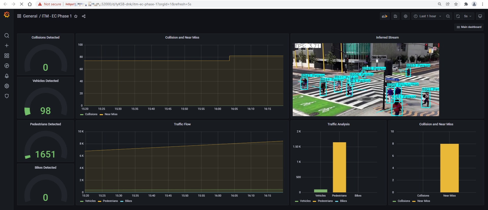

Figure 13: Grafana Dashboard of an individual camera feed

To view the detection results of all the configured camera feeds, click
on View All Streams from top right corner on the MapUI from the main
Grafana Dashboard i.e. ITM. Refer to Figure 11: Grafana Main Dashboard –
Wireless Network-Ready ITM.

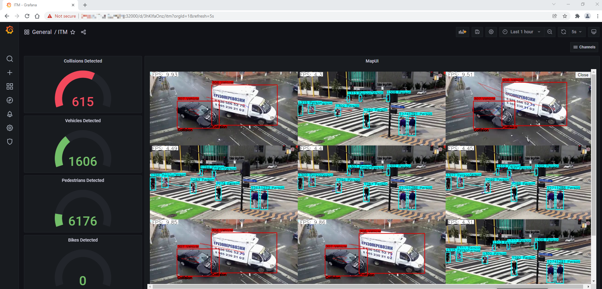

Figure 14: Detection results of all the configured camera feeds

>**NOTE:** To open combined streams in full tab, go to: https://<Controller_IP>:30300/get_all_streams

### Step 4: Uninstall the Application

1.  Check installed modules with the following command:
    ```
    cd /home/smartedge-open/wireless_network_ready_intelligent_traffic_management

    ./edgesoftware list
    ```

All installed modules will show as seen in the screen below:

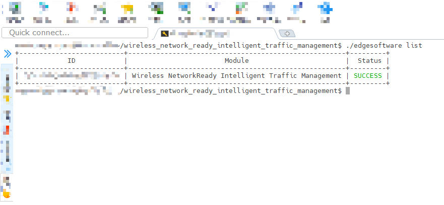

Figure 15: Installed modules list

2.  Run the command below to uninstall all the modules:

    `./edgesoftware uninstall –a`

3.  Run the command below to uninstall the Wireless Network Ready ITM reference implementation:

    `./edgesoftware uninstall <itm-id get from step 1>`

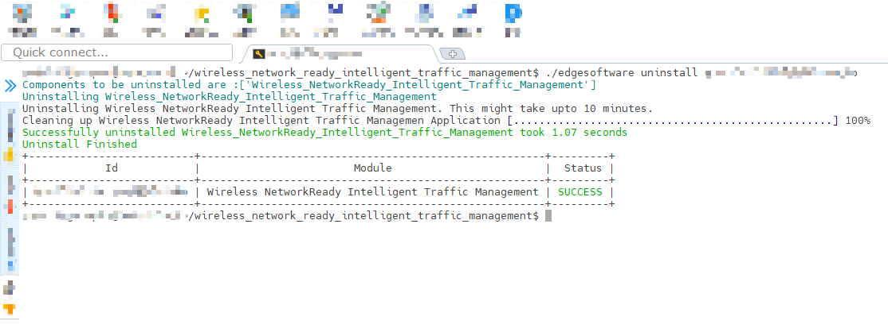

Figure 16: Uninstall modules

### Node Feature Discovery (NFD) Feature

Wireless Network-Ready Intelligent Traffic Management uses Intel® Distribution of OpenVINO™ toolkit which is optimized for Intel® processors that
support special instructions like AVX512VNNI for optimized performance. The deployment of this application will
require the node with this feature supported on the node along with Ubuntu 20.04 OS. This NFD features ensures
to deploy the application on the node supported with these features. NFD is installed by [Intel® Smart Edge Open Developer Experience Kit](https://software.intel.com/iot/edgesoftwarehub/download/home/Smart_Edge_Open_Developer_Experience_Kits) and running as two pods on [Intel® Smart Edge Open](https://software.intel.com/content/www/us/en/develop/tools/smart-edge-open.html).


```shell
   $ kubectl get pods -A | grep smartedge-system
   smartedge-system      nfd-release-node-feature-discovery-master-7b94765ccf-9ghjg   1/1    Running   5 (6d18h ago)    7d23h
   smartedge-system      nfd-release-node-feature-discovery-worker-dq4x6              1/1    Running   5 (6d18h ago)    7d23h
```

 Wireless Network-Ready Intelligent Traffic Management pods scheduled and running successfully on [Intel® Smart Edge Open](https://software.intel.com/content/www/us/en/develop/tools/smart-edge-open.html) node based on hardware capabilities of Intel® Xeon® Scalable server.

```shell
   $ kubectl get pods -A | grep smartedge-apps
   smartedge-apps           influxdb-57fc78dd78-jwrgl             1/1     Running   0             4d21h
   smartedge-apps           wnr-itm-7bd85c485c-mxscf              1/1     Running   0             4d21h
```

The following output shows a description of Wireless Network-Ready Intelligent Traffic Management pod, which shows that it is running successfully with the NFD feature.

```shell

   $ kubectl describe pod wnr-itm-7bd85c485c-mxscf -n smartedge-apps
   ...
   ...
   ...
    Node-Selectors:              feature.node.kubernetes.io/cpu-cpuid.AVX2=true
                                 feature.node.kubernetes.io/cpu-cpuid.AVX512VNNI=true
    Tolerations:                 node.kubernetes.io/not-ready:NoExecute op=Exists for 300s
                                 node.kubernetes.io/unreachable:NoExecute op=Exists for 300s

```


### Public Helm Registry for Helm Charts

Installation of Wireless Network-Ready Intelligent Traffic Management Reference Implementation on Intel® Smart Edge Open is accomplished using Helm charts. Earlier Helm charts used to be a part of Reference Implementation installation package. Now a global Helm repo is issued
so that Reference Implementation Helm charts can be accessible from private and public network. This will speed up and
ease the process of introducing updates and their integration with Reference Implementation.

## Local Build Instructions

After you have installed Intel® Smart Edge Open Developer Experience Kit from Prerequisites, you can build your own Wireless-Network Ready
Intelligent Traffic Management Docker image using the following instructions.

You can proceed with the steps presented using either edgesoftware sources or GitHub sources: WNR-ITM<github_link>

### Setup
Change the directory to repository path with one of the following options.

For Edgesoftware:

```
cd /home/smartedge-open/wireless_network_ready_intelligent_traffic_management/Wireless_NetworkReady_Intelligent_Traffic_Management_21.12/Wireless_NetworkReady_Intelligent_Traffic_Management
```

For GitHub:

```
git clone
cd wireless_network_ready_intelligent_traffic_management/
```

Use your preferred text editor to make the following file updates.

In the next steps, the tag `<REPOSITORY_PATH>` indicates the path to the repository.

In the Change examples, replace the line indicated by - with the line indicated by +

1. <REPOSITORY_PATH>/WNR_ITM/ITM/build_image.sh - update the tag and version for the image.
   ```
   Change example:
   -    -t intelligent_traffic_management:1.0 .
   +    -t <local_tag>/intelligent_traffic_management:<version> .
   ```
2. <REPOSITORY_PATH>/WNR_ITM/deploy/wireless-ready-itm/charts/itm/templates/deployment.yaml - update image deployment
   tag.
   ```
   Change example:
   - image: "intel/{{ .Values.image.repository }}:{{ .Values.image.Version }}"
   + image: "<local_tag>/{{ .Values.image.repository }}:{{ .Values.image.Version }}"
   ```
3. <REPOSITORY_PATH>/WNR_ITM/deploy/wireless-ready-itm/charts/itm/values.yaml - update version.
   ```
   Change example:
   -  Version: "1.0"
   +  Version: "<version>"
   ```
### Build and Install

Build the Docker image with the following commands:

```
cd <REPOSITORY_PATH>/WNR_ITM/ITM
./build_image.sh   # The local Docker image will be built on the Ubuntu machine.
```

Install Helm with the following commands:

1. Get Grafana password:

```
kubectl get secrets/grafana -n telemetry -o json | jq -r '.data."admin-password"' | base64 -d
```

2. Get Grafana service ip using the following command:

```
kubectl describe service -n telemetry grafana |grep -i Endpoint
```

3. Get the host ip using the following command:

```
hostname -I | awk '{print $1}'
```

4. Change directory to deployment directory from repository path:

```
cd <REPOSITORY_PATH>/WNR_ITM/deploy/
```

5. Using the host ip, Grafana service ip and password from steps 1 and 2, run the following Helm installation command:

```
helm install wnr-itm ./wireless-ready-itm --set itm.hostIp=<Controller_IP> --set itm.grafanaHost=<Grafana_PodIP>
--set itm.grafanaPassword=<Garafana_Password>
```

After step 5 completes, use your preferred browser to access WNR ITM at: https://Controller_IP:30300 and
Grafana https://Controller_IP:32000

### Optional Steps 

#### Configure the Input 

The **camera_config.json** file on the working directory contains all
the necessary configurations including the path to default input video.
If you wish to change the input, edit **camera_config.json** file and
add the required information. The role of elements in the
**camera_config.json** file are:

-   address: Name of the camera’s geographic location. Must be a
    non-empty alpha numeric string.

-   latitude: Latitude of the camera’s geographic location.

-   longitude: Longitude of the camera’s geographic location.

-   analytics: Attribute to be detected by the model.

    >**NOTE:** The default model support pedestrian, vehicle and bike
    detection. User can select desired attributes from these. (E.g.:
    "analytics": "pedestrian vehicle detection")

-   path: path to the input video

    >**NOTE:** Input videos should always be placed in /resources
    folder.

    To use camera stream instead of video, replace the video file
    name with /dev/video0

    To use RTSP stream instead of video, replace the video file name
    with the RTSP link.

#### Stop the Application

To remove the deployment of this reference implementation, run the
following commands.

>**NOTE:** The following commands will remove all the running pods and
the data and configuration stored in the device.

`helm delete wnr-itm`

## Summary and Next Steps

This application successfully implements Intel® Distribution of
OpenVINO™ toolkit plugins for detecting and tracking vehicles and
pedestrians and may be used for a basis in estimating a safety
metric for an intersection. It can be extended further to provide
support for a feed from a network stream (RTSP or camera device).

As a next step, you can experiment with accuracy/throughput trade-offs
by substituting object detector models and tracking and collision
detection algorithms with alternative ones.

In addition, on an appropriate platform with supporting RAN hardware you
can onboard a 3rd party 5G RAN (Radio Access Network) implementation
that will make it easy to host a private or public 5G small cell. To
perform video analytics wireless IP cameras can be connected through the
small cell, and the video traffic from the cameras can be routed via the
high-speed SmartEdge-Open data plane to the visual intelligence
container. With the 5G RAN and visual intelligence workloads hosted in a
single system, the solution benefits from faster data transfers between
the workloads and a reduced total cost of ownership.

## Learn More

To continue your learning, see the following guides and software
resources:

-   [Intel® Distribution of OpenVINO™ toolkit
    documentation](https://docs.openvinotoolkit.org/2021.1/index.html)

-   [Intel® Smart Edge Open Developer Experience Kit
    Architecture](https://github.com/intel-sandbox/applications.services.smart-edge-open.docs/blob/main/experience-kits/developer-experience-kit.md)

## Troubleshooting

### Pods status check

Verify that the pods are “**Ready**” as well as in “**Running**” state
using below command:

`kubectl get pods -n smartedge-apps`

If any pods are not in “Running” state, use the following command to get
more information about the pod state:

`kubectl describe -n smartedge-apps pod <pod_name>`

### ITM Dashboard Not Showing on Browser After Restart Server

Run the following commands:

```
# Get Grafana pod ip
kubectl get pod -n telemetry -owide |grep grafana* 
grafana-8465558bc8-5p65x            3/3     Running   24 (5h23m ago)   12d   10.245.179.203

#update ITM yaml file
kubectl set env deployment/wnr-itm -n smartedge-apps GRAFANA_HOST=10.245.179.203

```

### Pod status shows “ContainerCreating” for long time

If Pod status shows “ContainerCreating” or “Error” or “CrashLoopBackOff” for a while (5 minutes or more), run the following commands:

```
reboot

su
  
swapoff -a

systemctl restart kubelet  # Wait till all pods are in “Running” state.

./edgesoftware install
```

### Subprocess:32 issue

If you see any error related to subprocess, run the command below:

`pip install --ignore-installed subprocess32==3.5.4`

### Grafana Dashboard Not Showing on Browser

Run the following commands:

```
helm delete wnr-itm

# Get the ip for Grafana service
kubectl describe service -n telemetry grafana |grep -i Endpoint`

# Get the Grafana Password
kubectl get secrets/grafana -n telemetry -o json | jq -r '.data."admin-password"' | base64 -d 

helm install wnr-itm ./wireless-ready-itm --set itm.hostIp=<Controller_IP> --set itm.grafanaHost=<Grafana_PodIP>
--set itm.grafanaPassword=<Garafana_Password>"
```

## Support Forum

If you're unable to resolve your issues, contact the [Support
Forum](https://software.intel.com/en-us/forums/intel-edge-software-recipes).

To attach the installation logs with your issue, execute the command below to consolidate a list
of the log files in tar.gz compressed format, e.g., **ITM.tar.gz**.


`tar -czvf ITM.tar.gz /var/log/esb-cli/Wireless_NetworkReady_Intelligent_Traffic_Management_<version>/Component_name/install.log`
