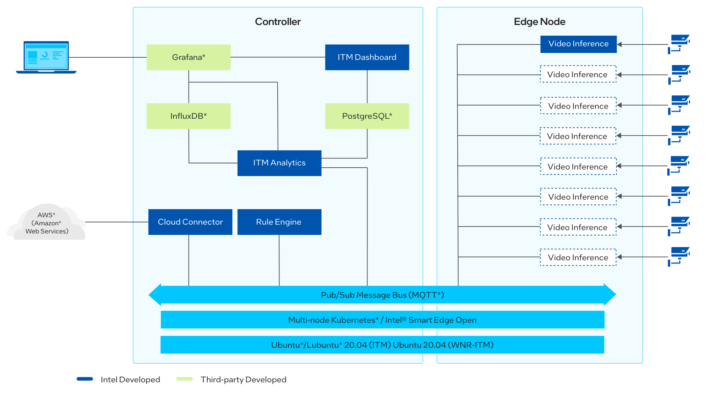
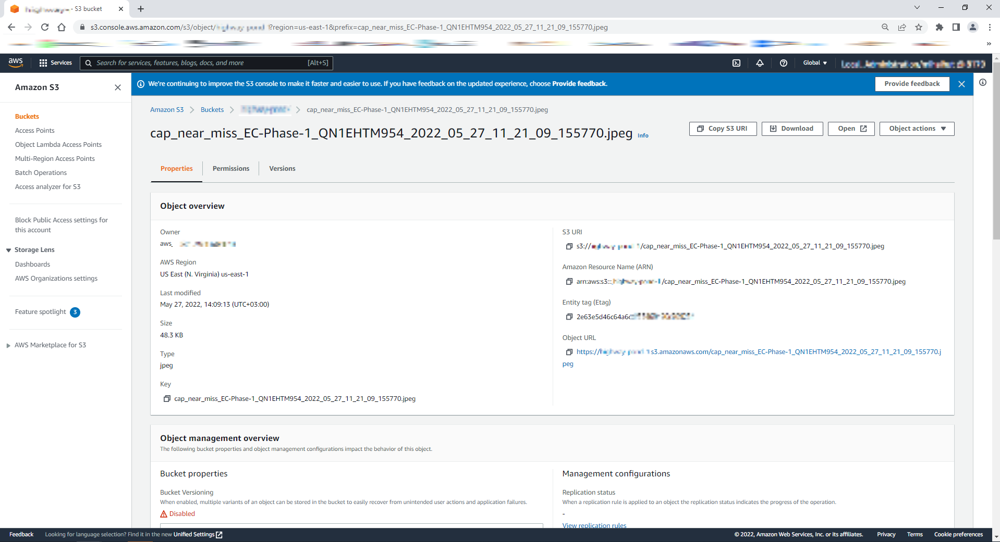
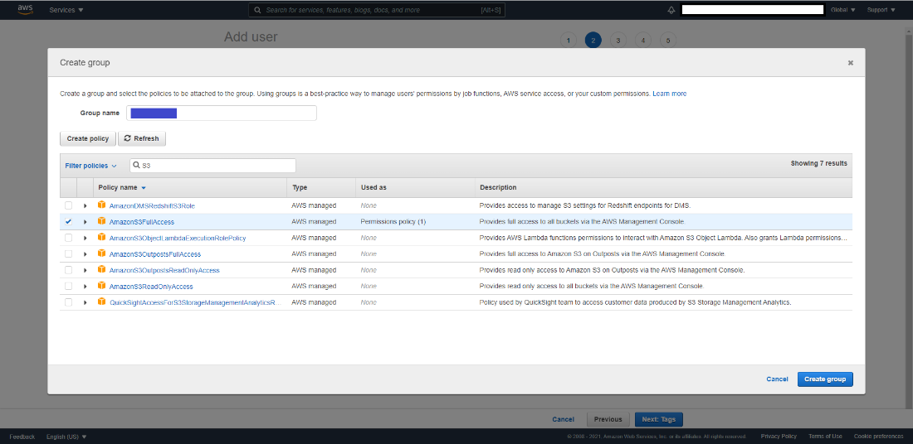
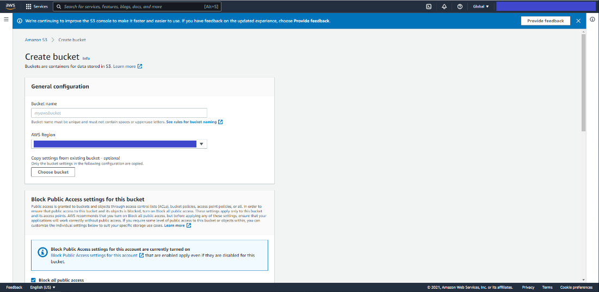

# Wireless Network-Ready Intelligent Traffic Management Reference Implementation
## Overview


Wireless Network-Ready Intelligent Traffic Management is designed to
detect and track vehicles and pedestrians and provides the
intelligence required to estimate a safety metric for an
intersection. In addition, the Intel® Smart Edge Open toolkit
included in the reference implementation could be used to host a 5G
radio access network (RAN) on the same edge device when implemented on a
platform supporting a 5G RAN.

Vehicles, motorcyclists, bicyclists and pedestrians are detected and
located in video frames via object detection deep learning
modules. Object tracking recognizes the same object detected across
successive frames, giving the ability to estimate
trajectories and speeds of the objects. The reference
implementation automatically detects collisions and near-miss
collisions. A real-time dashboard visualizes the intelligence extracted
from the traffic intersection along with annotated video stream(s).

This collected intelligence can be used to adjust traffic light cycling
to optimize the traffic flow of the intersection in near real time, or
to evaluate and enhance the safety of the
intersection. For example, emergency services notifications, i.e, 911
calls, could be triggered by collision detection, reducing emergency
response times. Intersections with higher numbers of collisions and
near-miss collision detections could be
flagged for authority's attention as high-risk intersections.

The data from the traffic cameras in the intersection can be
routed easily using the [SmartEdge-Open high-speed data
plane](https://github.com/open-ness/specs/blob/master/doc/architecture.md#dataplanecontainer-network-interfaces)
for near-real time video analytics in the field.
Further, SmartEdge-Open helps to build and manage the infrastructure to
deploy, monitor, and orchestrate virtualized applications across
multiple edge devices.

To run the reference implementation, you will need to first download and install the [Intel® Smart Edge Open Developer Experience Kit](https://software.intel.com/iot/edgesoftwarehub/download/home/Smart_Edge_Open_Developer_Experience_Kits).

Once you have installed the Intel® Smart Edge Open Developer Experience Kit, select **Configure & Download** to download the reference implementation and the software listed below.

[Configure & Download](http://software.intel.com/iot/edgesoftwarehub/download/home/ri/wireless_network_ready_intelligent_traffic_management)

>**NOTE:** This software package will not work on the People's Republic of China (PRC) network.

For the open source application, visit the [GitHub WNR-ITM
repository](https://github.com/intel/wireless-network-ready-intelligent-traffic-management)
for the source code.

-  **Time to Complete:** Approximately 10-15 minutes
-  **Programming Language:** Python*
-  **Available Software:**

    -  Intel® Distribution of OpenVINO™ toolkit 2021 Release
    -  Intel® Smart Edge Open 22.03.03 with multi-node support


## Target System Requirements

### Control Plane

-   One of the following processors:

    -   Intel® Xeon® Scalable processor.

    -   Intel® Xeon® processor D.

-   At least 32 GB RAM.

-   At least 256 GB hard drive.

-   An Internet connection.

-   Ubuntu\* 20.04 LTS Server.

### Edge Nodes

-   One of the following processors:

    -   Intel® Xeon® Scalable processor.

    -   Intel® Xeon® processor D.

-   At least 64 GB RAM.

-   At least 256 GB hard drive.

-   An Internet connection.

-   Ubuntu\* 20.04 LTS Server.
    
-   IP camera or pre-recorded video(s).

## How It Works

The application uses the inference engine and the Intel® Deep Learning Streamer (Intel® DL Streamer). The solution is
designed to detect and track vehicles and pedestrians by using
Intel® Smart Edge Open (version 22.03) with multi-node support.


Figure 1: How It Works

The Wireless Network-Ready application requires the application pods,
database and a visualizer. Once the installation is successful, the
application is ready to be deployed using Helm\*. After the deployment,
the application pod takes in the virtual/real RTSP stream addresses and
performs inference and sends metadata for each stream to the InfluxDB*
database. The visualizer in parallel shows the analysis over the
metadata like pedestrians detected, observed collisions and processed
video feed.

The application has capability to perform inferences over as much as 20
channels. In addition, the visualizer is capable to show each feed
separately as well as all the feeds at the same time using Grafana\*. The
user can visualize the output remotely over a browser, provided that
they are in same network.

New in this release are Rule Engine and Cloud Connector pods. 

*   Rule engine analyzes each video frame and its inference results. If it matches
    the configured rules (collision, near miss, overcrowd), it sends the
    video frame to Cloud Connector to be uploaded to the cloud storage.
    
*   Cloud Connector uses [Amazon Web Services* Cloud Storage](#set-up-amazon-web-services-cloud-storage) to save the
    video captures.





Figure 2: Architecture Diagram

## Get Started

### Prerequisites

To run the reference implementation, you will need to first download and install the [Intel® Smart Edge Open Developer Experience Kit](https://software.intel.com/iot/edgesoftwarehub/download/home/Smart_Edge_Open_Developer_Experience_Kits) with multi-node support. 

Ensure that the following conditions are met properly to ensure a smooth installation process for a reference implementation done through Edge Software Provisioner (ESP) Intel® Smart Edge Open Developer Experience Kit package.

Continue using the same ``smartedge-open`` user throughout this tutorial.

#### Hardware Requirements

Make sure you have a fresh **Ubuntu\* 20.04 LTS Server** installation
with the Hardware specified in the [Target System Requirements](#target-system-requirements) section.


### Step 1: Install the Reference Implementation

>**NOTE:** The following sections may use ``<Controller_IP>`` in a URL
or command. Make note of your Edge Controller’s IP address and
substitute it in these instructions.

Select **Configure &
Download** to download
the reference implementation and then follow the steps below to install
it.

[Configure &
Download](https://software.intel.com/iot/edgesoftwarehub/download/home/ri/wireless_network_ready_intelligent_traffic_management)

1.  Make sure that the Target System Requirements are met properly
    before proceeding further.


2.  If you are behind a proxy network, please ensure that proxy addresses are configured in the system.

    ```bash
    export http_proxy=proxy-address:proxy-port
    export https_proxy=proxy-address:proxy-port
    ```

3.  Open a new terminal as a smartedge-open user and move the downloaded .zip package to the /home/smartedge-open folder.
    ```bash
    mv path-of-downloaded-directory/wireless_network_ready_intelligent_traffic_management.zip /home/smartedge-open
    ```

4.  Go to the /home/smartedge-open directory using the following command
    and unzip the RI.
    ```bash
    cd /home/smartedge-open
    unzip wireless_network_ready_intelligent_traffic_management.zip
    ```

5.  Go to the `wireless_network_ready_intelligent_traffic_management/`
    directory.

    ```bash
    cd wireless_network_ready_intelligent_traffic_management
    ```

6.  Change permissions of the executable edgesoftware file to enable
    execution.

    ```bash
    chmod 755 edgesoftware
    ```

7.  Run the command below to install the Reference Implementation:

    ```bash
    ./edgesoftware install
    ```

8.  During the installation, you will be prompted for the AWS Key ID, AWS Secret, AWS Bucket and Product Key.
    The Product Key is contained in the email you received from Intel
    confirming your download. 
    AWS credentials are optional. 

    AWS Key ID, AWS Secret and AWS Bucket are obtained after following the steps
    in the [Amazon Web Services* Cloud Storage
    Setup](#set-up-amazon-web-services-cloud-storage) section. If you do not
    need the cloud upload feature, simply provide empty values by pressing
    **Enter** when prompted for the AWS credentials.

    > **NOTE:** Installation logs are available at path:
    >
    > `/var/log/esb-cli/Wireless_NetworkReady_Intelligent_Traffic_Management_<version>/<Component_Name>/install.log`

    

    Figure 3: Product Key


9.  When the installation is complete, you see the message ``Installation
    of package complete`` and the installation status for each module.

     

     Figure 4: Successful installation

10.  If Intel® Smart Edge Open was installed successfully, running the following
    command should show output similar to the image below. All the pods
    should have a status of either Running or Completed.

      ```bash
      kubectl get pods -A
      ```

     

     Figure 5: Status of pods

### Step 2: Check the Application

Check the `Wireless_NetworkReady_Intelligent_Traffic_Management` pod with the command:

```bash
kubectl get pod -n smartedge-apps
```

You will see output similar to:


Figure 6: Status of Wireless Network-Ready ITM pods

>**NOTE:** If the pods have a status of ``ContainerCreating``, please wait
for some time, since Kubernetes will pull the images from the registry
and then deploy them. This happens only the first time the containers
are deployed, and the wait time will depend upon the network bandwidth
available.

### Step 3: Data Visualization on Grafana

1.  Navigate to https://Controller_IP:30300/dashboard on your browser
    to check Wireless Network-Ready ITM dashboard.

    

    Figure 7: Login Wireless Network-Ready ITM dashboard

2.  Navigate to https://Controller_IP:30303/camera/0 on your browser
    to check Wireless Network-Ready ITM Camera.

    

    Figure 8: Wireless Network-Ready ITM Camera 0

    

    Figure 9: Wireless Network-Ready ITM dashboard

2.  Navigate to ``<Controller_IP>:32000`` on your
    browser to login to the Grafana dashboard.

3.  Get the **Grafana Password** by entering the command:

    ```bash
    kubectl get secrets/grafana -n telemetry -o json | jq -r '.data."admin-password"' | base64 -d
    ```

4.  Login with user as **admin** and password as **Grafana Password**

5.  Click **Home** and select the **ITM** to open the main dashboard.

    

    Figure 10: Grafana Home Screen

    

    Figure 11: Grafana Dashboard list

An example of the Wireless Network-Ready ITM dashboard:


Figure 12: Grafana Main Dashboard – Wireless Network-Ready ITM

The above dashboard shows the number of vehicles, pedestrians and
collisions detected on the left side. These may be used for adjusting
traffic lights and calling emergency services if collisions are
detected.

The blue drop pins on the Map are the geographic coordinates of camera.
By clicking on these pins, a small window of the camera feed can be
visible with the detection results, as shown in the figure below.


Figure 13: Detection results on MapUI

To open the Grafana Dashboard for a particular camera with the detection
results and other data metrics, click on the camera feed on the small
window, as shown in the figure below.

>**NOTE:** To close the small window with camera feed, click the close button
(X) on the top left corner of the window.


Figure 14: Grafana Dashboard of an individual camera feed

To view the detection results of all the configured camera feeds, click
on **View All Streams** from the top right corner on the MapUI from the main
Grafana Dashboard i.e. ITM. Refer to Figure 12: Grafana Main Dashboard –
Wireless Network-Ready ITM.


Figure 15: Detection results of all the configured camera feeds

>**NOTE:** To open combined streams in full tab, go to: ``https://<Controller_IP>:30303/get_all_streams``

If the AWS credentials were provided during the installation steps, then you
enabled the Cloud Upload feature.

Navigate to the configured AWS storage to find the uploaded video captures.


Figure 16: List of AWS S3 Bucket Objects



Figure 17: AWS S3 Bucket Object Properties


Figure 18: AWS S3 Bucket Object Photo

### Step 4: Uninstall the Application

1.  Check installed modules with the following command:
    ```bash
    cd /home/smartedge-open/wireless_network_ready_intelligent_traffic_management

    ./edgesoftware list
    ```

    All installed modules will show as seen in the screen below:

    

    Figure 19: Installed modules list

2.  Run the command below to uninstall all the modules:

    ```bash
    ./edgesoftware uninstall –a
    ```

3.  Run the command below to uninstall the Wireless Network Ready ITM reference implementation:

    ```bash
    ./edgesoftware uninstall <itm-id get from step 1>
    ```

    

    Figure 20: Uninstalled Modules

### Node Feature Discovery (NFD)

Wireless Network-Ready Intelligent Traffic Management uses Intel® Distribution of OpenVINO™ toolkit which is optimized for Intel® processors that
support special instructions like AVX512VNNI for optimized performance. The deployment of this application will
require the node with this feature supported on the node along with Ubuntu 20.04 OS. This NFD feature ensures
to deploy the application on the node supported with these features. NFD is installed by [Intel® Smart Edge Open Developer Experience Kit](https://software.intel.com/iot/edgesoftwarehub/download/home/Smart_Edge_Open_Developer_Experience_Kits) and running as two pods on [Intel® Smart Edge Open](https://software.intel.com/content/www/us/en/develop/tools/smart-edge-open.html).


```shell
$ kubectl get pods -A | grep smartedge-system
smartedge-system      nfd-release-node-feature-discovery-master-7b94765ccf-9ghjg   1/1    Running   5 (6d18h ago)    7d23h
smartedge-system      nfd-release-node-feature-discovery-worker-dq4x6              1/1    Running   5 (6d18h ago)    7d23h
```

 Wireless Network-Ready Intelligent Traffic Management pods scheduled and running successfully on [Intel® Smart Edge Open](https://software.intel.com/content/www/us/en/develop/tools/smart-edge-open.html) node based on hardware capabilities of Intel® Xeon® Scalable server.

```shell
$ kubectl get pods -A | grep smartedge-apps
smartedge-apps           influxdb-57fc78dd78-jwrgl             1/1     Running   0             4d21h
smartedge-apps           wnr-itm-7bd85c485c-mxscf              1/1     Running   0             4d21h
```

### Public Helm Registry for Helm Charts

Installation of Wireless Network-Ready Intelligent Traffic Management Reference Implementation on Intel® Smart Edge Open is accomplished using Helm charts. Earlier Helm charts used to be a part of Reference Implementation installation package. Now a global Helm repo is issued
so that Reference Implementation Helm charts can be accessible from private and public network. This will speed up and
ease the process of introducing updates and their integration with Reference Implementation.

## Local Build Instructions

After you have installed Intel® Smart Edge Open Developer Experience Kit from [Prerequisites](#prerequisites), you can build your own Wireless-Network Ready
Intelligent Traffic Management Docker image using the following instructions.

You can proceed with the steps presented using either edgesoftware sources or GitHub sources: [WNR-ITM Repository](https://github.com/intel/wireless-network-ready-intelligent-traffic-management)

### Setup
Change the directory to repository path with one of the following options.

For Edgesoftware:

```bash
cd /home/smartedge-open/wireless_network_ready_intelligent_traffic_management/Wireless_NetworkReady_Intelligent_Traffic_Management_22.1/Wireless_NetworkReady_Intelligent_Traffic_Management
```

For GitHub:

```bash
git clone
cd wireless_network_ready_intelligent_traffic_management/
git checkout --track origin/2022.1
```

Use your preferred text editor to make the following file updates.

In the next steps, the tag `<REPOSITORY_PATH>` indicates the path to the repository.

In the Change examples, replace the line indicated by - with the line indicated by +

1. <REPOSITORY_PATH>/src/build_images.sh - update the tag and version for the image.

    ```bash
    Change example:
    -    TAG="5.0"
    +    TAG="5.1"
    ```

2. <REPOSITORY_PATH>/helm/services/values.yaml - update image deployment harbor.

    ```bash
    Change example:
    - images:
    -   registry: ""
    + images:
    +   registry: <local harbor host>:<local_harbor_port>/<repository>/
    ```

3. <REPOSITORY_PATH>/helm/services/values.yaml - update version.

    ```bash
    Change example:
    - images:
    -   tag: "5.0"
    + images:
    +   tag: "5.1"
    ```
### Build and Install

Build the Docker image with the following commands:

```bash
cd <REPOSITORY_PATH>/src/
./build_images.sh  -c CONTROLLER_IP # The local Docker image will be built on the Ubuntu machine.
```

Install Helm with the following commands:

1. Get Grafana password:

    ```bash
    kubectl get secrets/grafana -n telemetry -o json | jq -r '.data."admin-password"' | base64 -d
    ```

2. Get the Grafana service IP using the following command:

    ```bash
    kubectl describe service -n telemetry grafana |grep -i Endpoint
    ```

3. Get the host IP using the following command:

    ```bash
    hostname -I | awk '{print $1}'
    ```

4. Change directory to deployment directory from repository path:

    ```bash
    cd <REPOSITORY_PATH>/helm/
    ```

5. Deploy the MQTT broker and wait for it to initialize:

    ```bash
    helm install broker broker/ --set namespace=smartedge-apps
    kubectl wait --namespace=smartedge-apps --for=condition=Ready pods --timeout=600s --selector=app=hivemq-cluster1
    ```


6. Using the host IP, Grafana service IP and password from steps 1 and 2, run the following Helm installation command:

    ```bash
    helm install wnr-itm services/ --wait --timeout 10m \
             --set grafana.password=<Grafana_Password> \
             --set grafana.ip=<Grafana_PodIP> \
             --set host_ip=<Controller_IP> \
             --set namespace=smartedge-apps \
             --set proxy.http=<HTTP_PROXY> \
             --set proxy.https=<HTTPS_PROXY> \
             --set cloud_connector.aws_key=<AWS_KEY_ID> \
             --set cloud_connector.aws_secret=<AWS_SECRET> \
             --set cloud_connector.aws_bucket=<AWS_BUCKET>
    ```

>**NOTES:**
>1. If your host is not behind a firewall, then skip setting the http and https proxy.
>
>2. Cloud connector requires your AWS credentials to connect to it to upload video captures in case of collision,
>near miss and overcrowd events. If you don't want this feature enabled, then skip setting these parameters.
>For instructions on how to configure AWS, refer to the [Set Up Amazon Web Services* Cloud Storage](#set-up-amazon-web-services-cloud-storage) section.
>3. If the command above fails with an error related to PostgreSQL dependencies, execute the following command:  ``helm dependency build services/``


After step 6 completes, use your preferred browser to access WNR ITM at: ``https://Controller_IP:30300`` and
Grafana ``https://Controller_IP:32000``

### Optional Steps

#### Configure the Input

The Helm templates contains all the necessary configurations for the cameras.

If you wish to change the input, edit the ``./helm/services/values.yaml`` file and
add the video inputs to the **test_videos** array:
```bash
itm_video_inference:
  name: "itm-video-inference"
  topic:
    publisher: "camera"
  test_videos:
    - uri: "file:///app/test_videos/video_car_crash.avi"
    - uri: "file:///app/test_videos/video_pedestrians.avi"
```

To use camera stream instead of video, replace the video file
name with ``/dev/video0``.

To use RTSP stream instead of video, replace the video file name
with the RTSP link.

Each ITM Video Inference service will pick a video input in the order above.

If you wish to change the coordinates, address and the analytics type of the
cameras, edit the ``./helm/services/templates/itm-analytics-configmap.yaml``
file:


-   address: Name of the camera’s geographic location. Must be a
    non-empty alpha numeric string.

-   latitude: Latitude of the camera’s geographic location.

-   longitude: Longitude of the camera’s geographic location.

-   analytics: Attribute to be detected by the model.

    >**NOTE:** The default model supports pedestrian, vehicle and bike
    detection. You can select desired attributes from these. (E.g.:
    "analytics": "pedestrian vehicle detection")


#### Stop the Application

To remove the deployment of this reference implementation, run the
following commands.

>**NOTE:** The following commands will remove all the running pods and
the data and configuration stored in the device, except the MQTT Broker.

```bash
helm delete wnr-itm
```

If you wish to remove the MQTT Broker too, enter the command:

```bash
helm delete broker
```

## Set Up Amazon Web Services Cloud* Storage

To enable Cloud Storage on the installed Reference Implementation, you
will need Amazon Web Services\* (AWS*) paid/free subscription to enable
your root user account that has to support the following services:


-  Identity and Access Management (IAM)
-  Amazon S3 Bucket


After finishing the setup for IAM and S3, you will have your
``AWS_KEY_ID``, ``AWS_SECRET_KEY`` and ``AWS_BUCKET_NAME`` to be used
on your Wireless Network Ready Intelligent Traffic Management
Cloud Connector - Configuration.


**References**


-  [AWS IAM Official Documentation](https://docs.aws.amazon.com/IAM/latest/UserGuide/introduction.html)
-  [AWS IAM Create and Setup Official documentation](https://docs.aws.amazon.com/IAM/latest/UserGuide/id_users_create.html)


### Setup Steps


1. From your AWS management console, search for IAM and open the IAM Dashboard.

   

   Figure 21: IAM Dashboard

2. On the left menu of the dashboard, go to **Access management** and
   click on **Users** to open the IAM Users tab.

   

   Figure 22: IAM Users Tab

3. From the IAM users tab, click on **Add User** to access the AWS add
   user setup.

4. On the first tab, provide the username and select the AWS credentials
   type to be **Access key**.

   

   Figure 23: Set User Details Tab

5. On the second tab, create a group to attach policies for the new IAM
   user.

   a. Search for S3 and select **AmazonS3FullAccess** policy.

   b. Click on **Create group**.

      

      Figure 24: Create Group Tab

6. Select the group you have created and click on **Next: Tags**.

7. Tags are optional. If you don't want to add tags, you can continue to
   the Review tab by clicking on **Next: Review**.

8. After review, you can click on the **Create User** button.

9. On this page, you have access to AWS Key and AWS Secret Access key.
   (Click on **Show** to view them.)

   a. Save both of them to be used later on your Cloud Data -
      Configuration on the Edge Insights for Fleet Reference
      Implementation you have installed.

     >**NOTE:** The AWS Secret Key is visible only on this page, you cannot get
         the key in any other way.


   b. If you forget to save the AWS Secret Key, you can delete the old
      one and create another key.

   

   Figure 25: AWS Key and Secret Access Key

10. After you have saved the keys, close the tab. You are returned to the
   IAM Dashboard page.


11. Click on the user created and save the **User ARN** to be used on S3
   bucket setup.


>**NOTE:**
      If you forget to save the AWS Secret key from the User tab,
      you can select **Security Credentials**, delete the Access Key and
      create another one.


### S3 Bucket

S3 bucket service offers cloud storage to be used on cloud based
applications.


**S3 Bucket Service setup**


1. Open the Amazon Management Console and search for Amazon S3.

2. Click on **S3** to open the AWS S3 Bucket dashboard.
   

   Figure 26: AWS S3 Bucket Dashboard

3. On the left side menu, click on **Buckets**.

4. Click on the **Create Bucket** button to open the Create Bucket
   dashboard.

5. Enter a name for your bucket and select your preferred region.
   

   Figure 27: Create Bucket General Configuration

6. Scroll down and click on **Create Bucket**.

7. From the S3 Bucket Dashboard, click on the newly created bucket and
   go to the **Permissions** tab.

8. Scroll to **Bucket Policy** and click on **Edit** to add a new
   statement in statements tab that is already created to deny all the
   uploads.
   

   Figure 28: Edit Bucket Policy

9. You must add a comma before adding the following information.
    ```bash
    {
      "Sid": "<Statement name>",
      "Effect": "Allow",
      "Principal": {
          "AWS": "<User_ARN_Saved>"
      },
      "Action": "s3:*",
      "Resource": [
          "arn:aws:s3:::<bucket_name>",
          "arn:aws:s3:::<bucket_name>/*"
      ]
    }
    ```

    a. Update with the following statement with statement name, your user
      ARN saved at IAM setup - step 11 and your bucket name.

    b. Click on **Save changes**. If the change is successful, you will
     see a **success saved** message, otherwise you need to re-analyze
     the json file to fix the error.


## Summary and Next Steps

This application successfully implements Intel® Distribution of
OpenVINO™ toolkit plugins for detecting and tracking vehicles and
pedestrians and may be used for a basis in estimating a safety
metric for an intersection. It can be extended further to provide
support for a feed from a network stream (RTSP or camera device).

As a next step, you can experiment with accuracy/throughput trade-offs
by substituting object detector models and tracking and collision
detection algorithms with alternative ones.

In addition, on an appropriate platform with supporting RAN hardware you
can onboard a 3rd party 5G RAN (Radio Access Network) implementation
that will make it easy to host a private or public 5G small cell. To
perform video analytics wireless IP cameras can be connected through the
small cell, and the video traffic from the cameras can be routed via the
high-speed SmartEdge-Open data plane to the visual intelligence
container. With the 5G RAN and visual intelligence workloads hosted in a
single system, the solution benefits from faster data transfers between
the workloads and a reduced total cost of ownership.


## Learn More

To continue your learning, see the following guides and software
resources:

-   [Intel® Distribution of OpenVINO™ toolkit
    documentation](https://docs.openvino.ai/2021.4/index.html)

-   [Intel® Smart Edge Open Developer Experience Kit
    Architecture](https://smart-edge-open.github.io/docs/experience-kits/developer-experience-kit/)

## Troubleshooting

### Pods status check

Verify that the pods are **Ready** as well as in **Running** state
using the below command:

```bash
kubectl get pods -n smartedge-apps
```

If any pods are not in **Running** state, use the following command to get
more information about the pod state:

```bash
kubectl describe -n smartedge-apps pod <pod_name>
```

### ITM Dashboard Not Showing on Browser After Restart Server

Run the following commands:

```bash
# Get Grafana pod ip
kubectl get pod -n telemetry -owide |grep grafana* 
grafana-8465558bc8-5p65x            3/3     Running   24 (5h23m ago)   12d   10.245.179.203

#update ITM yaml file
kubectl set env deployment/wnr-itm -n smartedge-apps GRAFANA_HOST=10.245.179.203
```

### Pod status shows “ContainerCreating” for long time

If Pod status shows “ContainerCreating” or “Error” or “CrashLoopBackOff” for a while (5 minutes or more), run the following commands:

```bash
reboot
su
swapoff -a
systemctl restart kubelet  # Wait till all pods are in “Running” state.
./edgesoftware install
```

### Subprocess:32 issue

If you see any error related to subprocess, run the command below:

```bash
pip install --ignore-installed subprocess32==3.5.4
```

### Grafana Dashboard Not Showing on Browser

Run the following commands:

```bash
helm delete wnr-itm

# Get the ip for Grafana service
kubectl describe service -n telemetry grafana |grep -i Endpoint`

# Get the Grafana Password
kubectl get secrets/grafana -n telemetry -o json | jq -r '.data."admin-password"' | base64 -d 

helm install wnr-itm ./wireless-ready-itm --set itm.hostIp=<Controller_IP> --set itm.grafanaHost=<Grafana_PodIP>
--set itm.grafanaPassword=<Garafana_Password>"
```

## Support Forum

If you're unable to resolve your issues, contact the [Support
Forum](https://software.intel.com/en-us/forums/intel-edge-software-recipes).

To attach the installation logs with your issue, execute the command below to consolidate a list
of the log files in tar.gz compressed format, e.g., **ITM.tar.gz**.

```bash
tar -czvf ITM.tar.gz /var/log/esb-cli/Wireless_NetworkReady_Intelligent_Traffic_Management_<version>/Component_name/install.log
```

